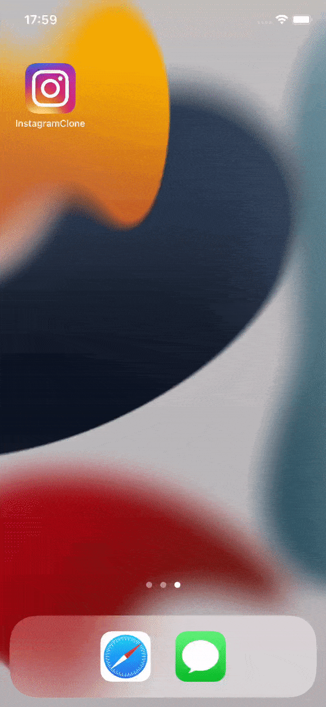
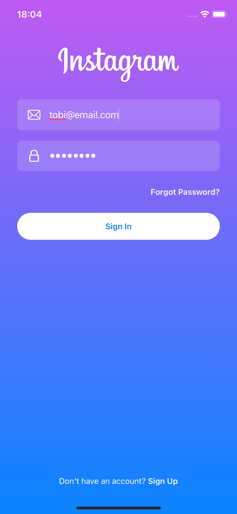
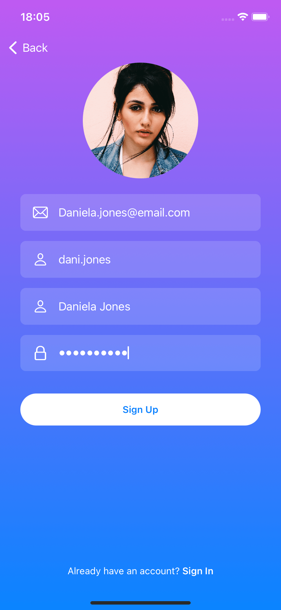
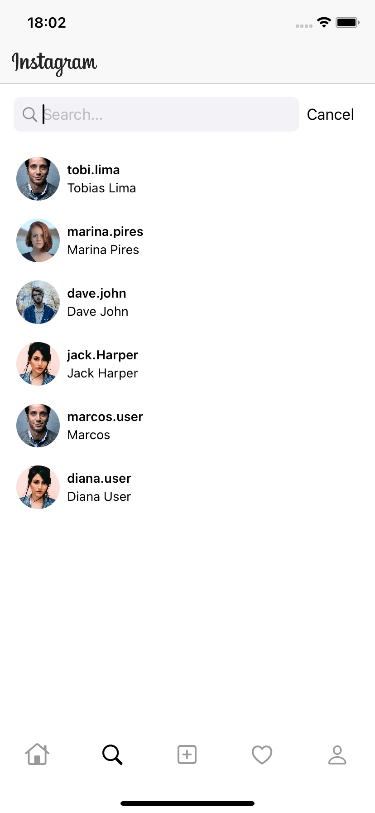
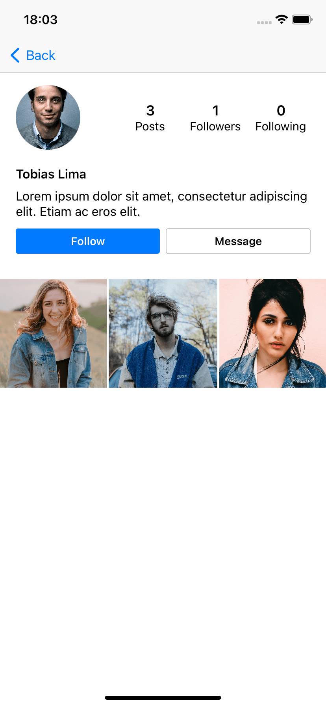
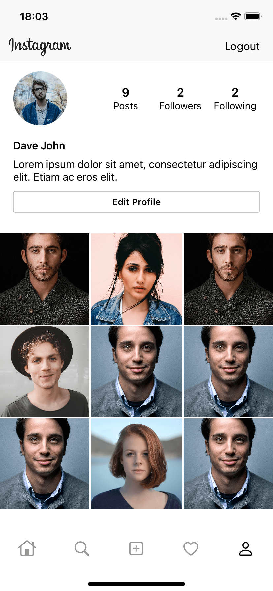
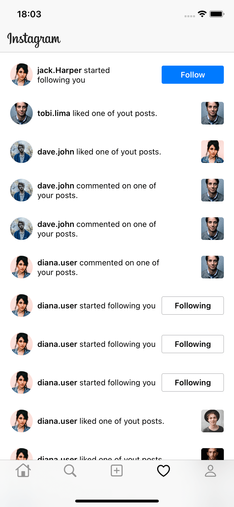

  

   <h2 align="center">
    Swift UI Instagram Clone + MVVM + Firebase
  </h2>

  
  

Instagram app clone using Swift UI features from IOS. The app includes timeline, post creation, notifications, profile page, likes, comments and authentication flow. The application was developed with the purpose of learn Swift UI, using the MVVM Architecture and Firebase Firestore as database

# Preview

|            Splash            |           Sign In           |              Sign Up              |
| :--------------------------: | :-------------------------: | :-------------------------------: |
|  |  |  |

|            Feed             |            Comment            |            New Post            |
| :-------------------------: | :---------------------------: | :----------------------------: |
|  |  |  |

|            Search Users            |            User            |            Profile            |
| :--------------------------------: | :------------------------: | :---------------------------: |
|  |  |  |

|            Search            |            Notification            |
| :--------------------------: | :--------------------------------: |
|  |  |

## Thanks

with ❤️ by Gustavo
